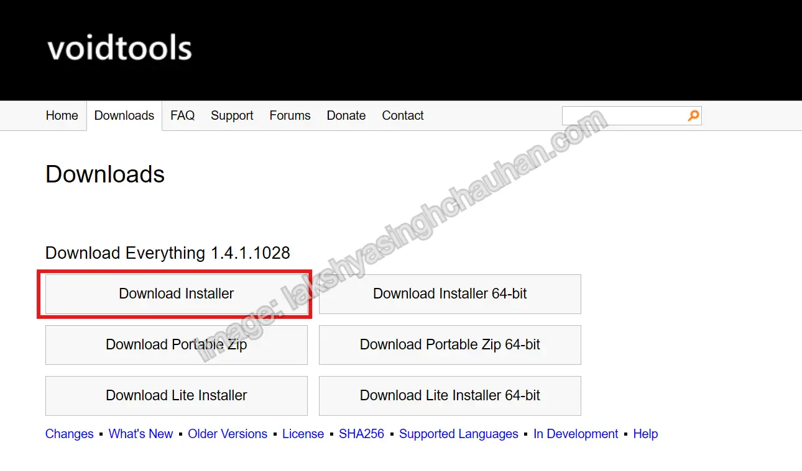
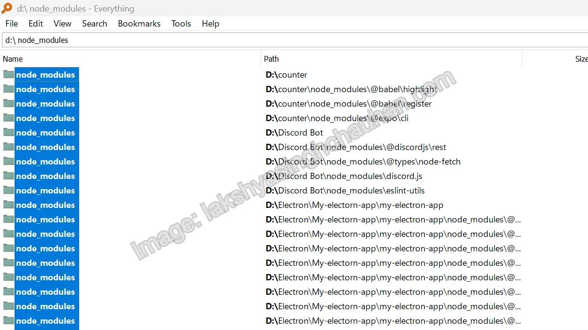
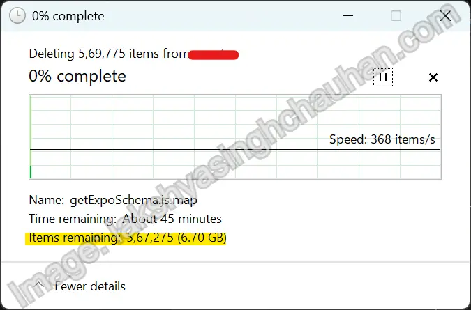

As a JavaScript developer, you've likely collected countless `node_modules` folders over time. These directories can grow massive and are often left behind by forgotten or abandoned projects.

In this post, we’ll walk through how to easily find and delete these folders on Windows using the **Everything** search utility.

## Why Delete `node_modules` Folders?

* They take up **huge amounts of disk space**
* Often leftover from projects you no longer use
* Cleaning them improves file system performance


_Credit: <https://tsh.io>_

## Step 1: Install the Everything App

Everything is a super-fast search tool for Windows that can instantly find files and folders by name.

👉 [Download Everything](https://www.voidtools.com/downloads/)


_The voidtools website for Everything download_

## Step 2: Search for `node_modules`

Open Everything and type `node_modules`

You’ll instantly see all `node_modules` folders across all your drives.


_All of the selected files_

## Step 3: Sort by Size (Optional)

To find the largest folders first:

1. Right-click the column headers.
2. Enable the **Size** column.
3. Click on **Size** to sort in descending order.

## Step 4: Verify Before Deleting

Right-click on any folder and choose **“Open path”** to inspect its contents.
Make sure it’s safe to delete (i.e., not from a current project).

## Step 5: Delete Multiple Folders at Once

1. Use Ctrl or Shift + Click to select multiple entries.
2. Press **Shift + Delete** to permanently remove them.

> Be careful! This bypasses the Recycle Bin.
{: .prompt-danger}


_There go the files!_

## Bonus: PowerShell Cleanup Script

Want to automate the cleanup? Try this PowerShell script:

```powershell
Get-ChildItem -Path C:\ -Recurse -Directory -Force -ErrorAction SilentlyContinue \
    -Filter node_modules | Remove-Item -Recurse -Force -WhatIf
```

> Replace `-WhatIf` with `-Confirm:$false` to actually delete the folders.

## Conclusion

With the Everything app, cleaning up old `node_modules` folders is fast, easy, and satisfying. Clear the clutter and reclaim your disk space today!
